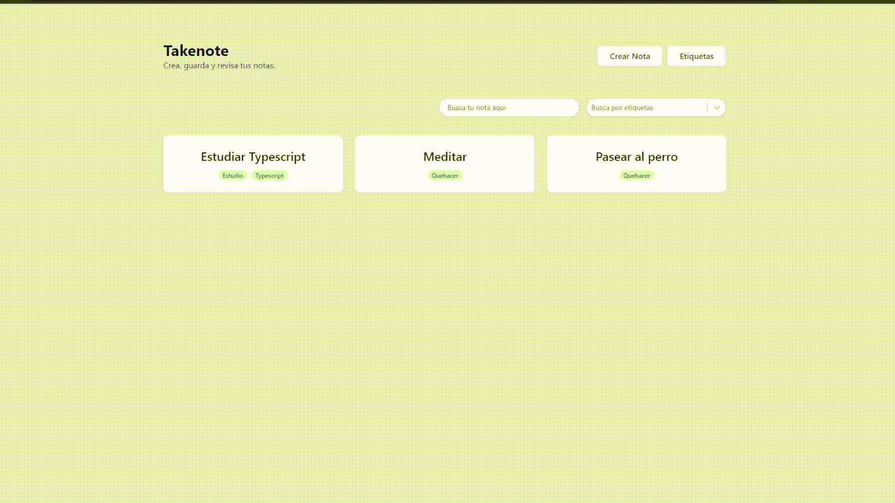

<h1 align="center">Hi 👋, I'm Andre</h1>

  
  
  

Software Engineer focused on Web Development, I am motivated by the power of the web as a tool for solving everyday problems.

See [my website](https://andreyanez.netlify.app/) for more information!

<h1 align="center">Projects</h1>
<table bordercolor="#66b2b2">
  
  <tr>
    <td width="50%" valign="top">
      <h3 align="center">Estify</h3>
         
        
         
        

          
    
  
      

        
<strong>Typescript, React, Node.js, Express, Tailwind</strong> - Visualize your spotify stats and discover your listening trends.

    </td>
    <td width="50%" valign="top">
      <h3 align="center">HomeFound</h3>
         
      
         
        

          
  
  
      

        
<strong>Nuxt, Algolia, Stripe, TailwindCSS</strong> - Find and register places to live all over the world.

    </td>
  </tr>
  
  <tr>
    <td width="50%" valign="top">
      <h3 align="center">Takenote</h3>
       
        
       
        

  
  
      

        
<strong>Typescript, React, TaildwindCSS</strong> - Markdown-supported note taking app.

    </td>
    <td width="50%" valign="top">
      <h3 align="center">Caesar Cipher Generator</h3>
         
        
         
        

          
  
  
      

        
<strong>Nuxt, Vue 3, TaildwindCSS</strong> - A small Nuxt app capable of transform text using the caesar cipher.

    </td>
  </tr>
</table>
